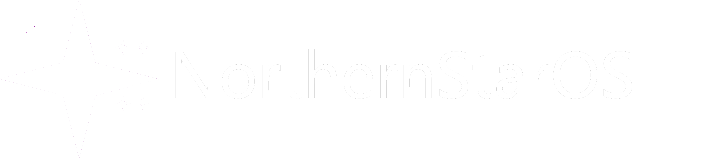

# NorthernStarOS

This is a risc-v operating system im working on

# BUILD INSTRUCTIONS

make sure you have the risc-v build tools

you can get the windows ones [here](https://github.com/realzvqle/riscv64-build-windows)
 
then make sure you have "make" installed. and then finally, make sure you have qemu (riscv64) installed

After that, you're all done! just run make run and you're good!